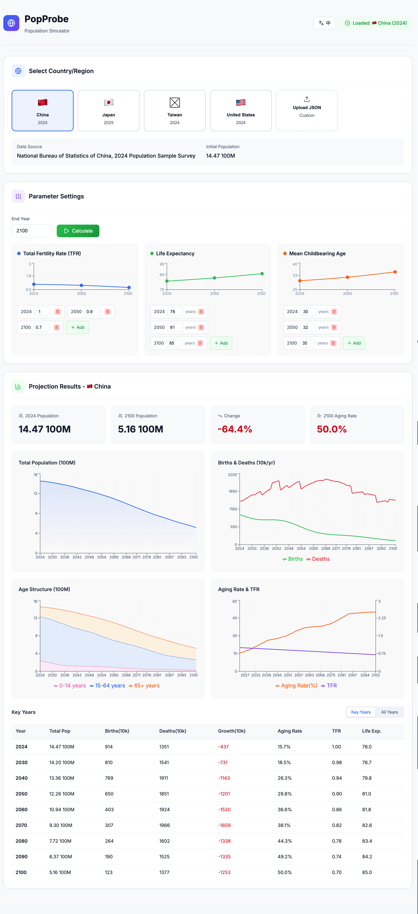
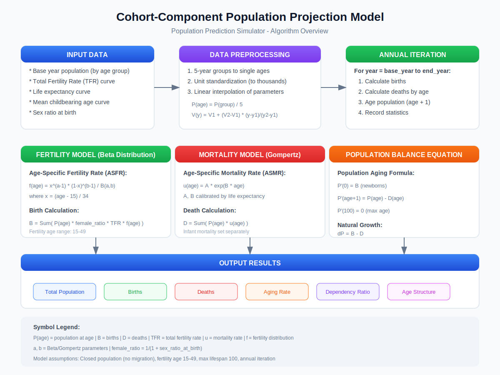

# PopProbe - Population Simulator

[中文文档](./docs/README_zh.md)

> **[Live Demo](https://your-username.github.io/popprobe/)** *(Coming Soon)*

## Overview

This simulator is based on the **Cohort-Component Method**, the most widely used population projection method internationally. It divides the population by age groups and simulates births, deaths, and aging processes year by year to predict future population trends.





---

## Core Algorithm

### 1. Data Preprocessing

#### 1.1 Age Group Expansion

Raw data is typically in 5-year age groups (e.g., 0-4, 5-9). It needs to be expanded to single-year ages:

```
P_single(a) = P_group(g) / 5,  a ∈ [g_start, g_end]
```

#### 1.2 Unit Standardization

Supports multiple population unit inputs (person, thousand, ten thousand, hundred million), internally converted to **thousands** for calculation:

| Input Unit | Conversion Factor |
|-----------|------------------|
| Person | ÷ 1000 |
| Thousand | × 1 |
| Ten Thousand | × 10 |
| Hundred Million | × 100000 |

#### 1.3 Parameter Interpolation

Dynamic parameters (TFR, life expectancy, childbearing age) use **linear interpolation** to obtain values for any year:

```
V(y) = V₁ + (V₂ - V₁) × (y - y₁) / (y₂ - y₁)
```

---

### 2. Fertility Model

#### 2.1 Beta Distribution Fertility Rate

Uses Beta distribution to simulate Age-Specific Fertility Rate (ASFR) distribution:

```
f(x; α, β) = x^(α-1) × (1-x)^(β-1) / B(α, β)
```

Where:
- `x = (age - 15) / 34`, mapping age to [0,1] interval
- Fertility age range: 15-49 years
- α, β calculated from mean childbearing age and standard deviation

#### 2.2 Birth Calculation

```
B = Σ P(a) × r_f × TFR × f(a)   (a = 15 to 49)
```

Where:
- `P(a)` = population at age a
- `r_f` = female ratio = 1 / (1 + SRB) (SRB = sex ratio at birth)
- `TFR` = total fertility rate
- `f(a)` = normalized fertility rate at age a

---

### 3. Mortality Model

#### 3.1 Gompertz Mortality Rate

Uses Gompertz model to describe exponential growth of adult mortality with age:

```
μ(a) = A × e^(B × a)
```

Where A, B are calibrated to match calculated life expectancy with target value.

#### 3.2 Age-Specific Mortality Settings

| Age Range | Mortality Model |
|-----------|----------------|
| 0 years | 0.5% (infant mortality) |
| 1-4 years | 0.1% |
| 5-14 years | 0.03% |
| 15-99 years | Gompertz model |
| 100 years | 100% (maximum age) |

#### 3.3 Death Calculation

```
D = Σ P(a) × μ(a)   (a = 0 to 100)
```

#### 3.4 Life Expectancy Calibration

Grid search finds optimal parameters (A, B) to match calculated life expectancy to target:

```
e₀ = Σ l(a)   (a = 0 to 100)
```

Where `l(a) = Π(1 - μ(i))` is the probability of surviving to age a.

---

### 4. Population Balance Equation

Annual population updates follow these rules:

```
P'(0) = B                          # Newborns
P'(a+1) = P(a) - D(a), a ∈ [0,99)  # Aging minus deaths
P'(100) = 0                        # Maximum age limit
```

**Natural Growth:**

```
ΔP = B - D
Growth rate r = (B - D) / P_total × 100%
```

---

## Output Indicators

### Annual Output

| Indicator | Description | Formula |
|-----------|-------------|---------|
| Total Population | Sum of all ages | Σ P(a) |
| Births | Newborns in year | Beta distribution model |
| Deaths | Deaths in year | Gompertz model |
| Natural Growth | Births minus deaths | B - D |
| 0-14 Population | Youth population | Σ P(a), a=0~14 |
| 15-64 Population | Working age population | Σ P(a), a=15~64 |
| 65+ Population | Elderly population | Σ P(a), a=65~100 |
| Aging Rate | Elderly proportion | P_65+ / P_total × 100% |
| Dependency Ratio | Non-working/working | (P_0-14 + P_65+) / P_15-64 × 100% |

---

## Model Assumptions and Limitations

### Assumptions

1. **Closed Population**: No international migration
2. **Smooth Changes**: Parameters change linearly between control points
3. **Gender Equality**: Only female population considered for fertility
4. **Age Limit**: Maximum age set to 100 years

### Limitations

1. Does not consider sudden events (wars, pandemics, natural disasters)
2. Does not consider sudden policy changes
3. Socioeconomic factors in fertility behavior simplified
4. Mortality model may be imprecise for very old ages

---

## Data Sources

### Supported Countries/Regions

| Country/Region | Data Year | Data Source |
|---------------|-----------|-------------|
| China | 2024 | National Bureau of Statistics |
| Japan | 2025 | Statistics Bureau of Japan |
| Taiwan | 2024 | Ministry of Interior |
| USA | 2024 | U.S. Census Bureau |

### JSON Configuration File Format

```json
{
  "country": "Country Name",
  "year": 2024,
  "population_unit": "thousand",
  "population_by_age_group": {
    "0-4岁": value,
    "5-9岁": value,
    "...": "...",
    "95岁以上": value
  },
  "parameters": {
    "sex_ratio_at_birth": 1.05,
    "fertility_std_dev": 5.5,
    "dynamic_tfr": {
      "values": {"2024": 1.0, "2050": 0.9, "2100": 1.0}
    },
    "dynamic_life_expectancy": {
      "values": {"2024": 78, "2050": 82, "2100": 85}
    },
    "dynamic_childbearing_age": {
      "values": {"2024": 30, "2050": 32, "2100": 33}
    }
  }
}
```

---

## Usage

### Web Version

```bash
cd web
npm install
npm run dev
# Visit http://localhost:5173
```

Features:
1. Select preset country/region or upload custom JSON
2. Visually adjust TFR, life expectancy, mean childbearing age curves
3. Add/delete/modify parameter nodes
4. View charts and data tables

### Build for Production

```bash
cd web
npm run build
# Output in web/dist/
```

---

## Project Structure

```
├── README.md                 # This file (English)
├── docs/
│   ├── README_zh.md          # Chinese documentation
│   ├── population_model.svg  # English diagram
│   └── population_model_zh.svg # Chinese diagram
├── data/                     # JSON configuration files
│   ├── 2024China.json
│   ├── 2024Taiwan.json
│   ├── 2024USA.json
│   └── 2025Japan.json
└── web/                      # React frontend
    └── src/
        ├── App.jsx
        ├── simulator.js      # Core algorithm
        └── data/             # Bundled configs
```

---

## References

1. Preston, S. H., Heuveline, P., & Guillot, M. (2001). *Demography: Measuring and Modeling Population Processes*. Blackwell Publishers.

2. Gompertz, B. (1825). "On the Nature of the Function Expressive of the Law of Human Mortality". *Philosophical Transactions of the Royal Society*.

3. United Nations. (2022). *World Population Prospects 2022: Methodology*.

---

## License

MIT License

---

*Last updated: January 2026*
