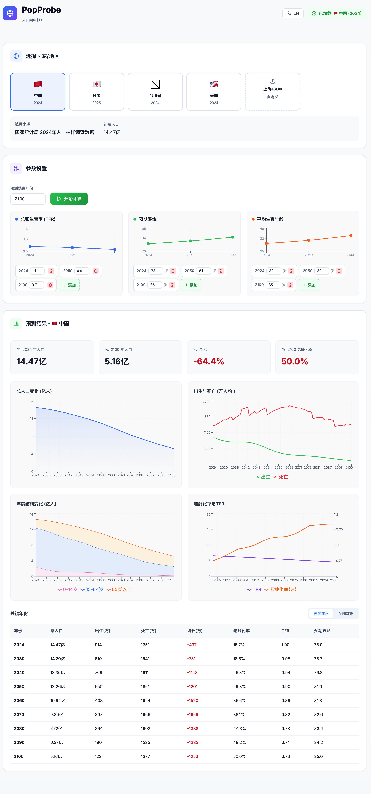
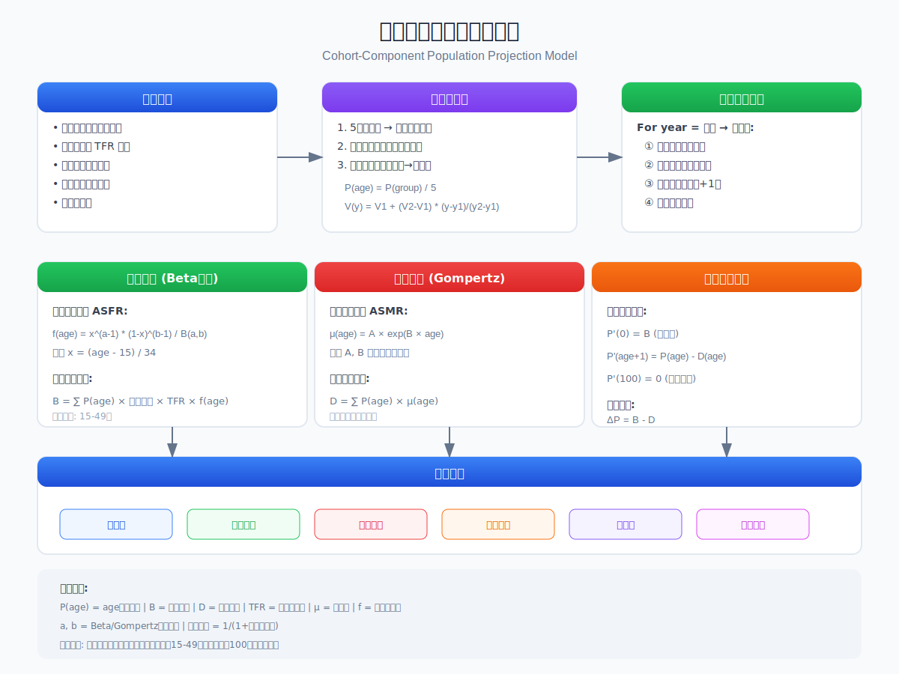

# PopProbe - 人口模拟器

[English Documentation](../README.md)

> **[在线演示](https://harmony2ww.github.io/PopProbe/)**

## 概述

本模拟器基于**队列要素法（Cohort-Component Method）**，这是国际上最广泛使用的人口预测方法。该方法将人口按年龄分组，逐年模拟出生、死亡和老化过程，从而预测未来人口变化趋势。





---

## 核心算法

### 1. 数据预处理

- **年龄组展开**：5岁组 → 单岁人口：`P(age) = P(group) / 5`
- **单位标准化**：统一转换为千人
- **参数插值**：线性插值获取任意年份的值

### 2. 生育模型（Beta分布）

```
f(x; α, β) = x^(α-1) × (1-x)^(β-1) / B(α, β)
B = Σ P(age) × 女性比例 × TFR × f(age)   (age = 15-49)
```

### 3. 死亡模型（Gompertz）

```
μ(age) = A × e^(B × age)
D = Σ P(age) × μ(age)
```

参数 A, B 由预期寿命校准。

### 4. 人口转移方程

```
P'(0) = B                    # 新生儿
P'(age+1) = P(age) - D(age)  # 老化并扣除死亡
ΔP = B - D                   # 自然增长
```

---

## 输出指标

| 指标 | 说明 |
|-----|------|
| 总人口 | 所有年龄人口之和 |
| 出生/死亡人数 | 当年新生儿/死亡数量 |
| 自然增长 | 出生减死亡 |
| 老龄化率 | 65岁以上人口占比 |
| 抚养比 | 非劳动人口/劳动人口 |

---

## 模型假设与局限性

**假设**：封闭人口（不考虑迁移）、参数线性变化、最大年龄100岁

**局限性**：不考虑突发事件、政策突变、社会经济因素简化处理、暂未考虑2100年末人均预期寿命达到150岁的情况

---

## 数据来源

| 国家/地区 | 数据年份 | 数据来源 |
|----------|---------|---------|
| 中国 | 2024 | 国家统计局 |
| 日本 | 2025 | 日本总务省统计局 |
| 台湾 | 2024 | 内政部户政司 |
| 美国 | 2024 | 美国人口普查局 |

---

## 使用方法

### Web版本

```bash
cd web
npm install
npm run dev
# 访问 http://localhost:5173
```

### 构建生产版本

```bash
cd web
npm run build
# 输出到 web/dist/
```

**功能**：选择预置国家或上传JSON、可视化调整参数曲线、查看图表和数据表格

---

## 项目结构

```
├── README.md                 # 英文文档
├── docs/
│   ├── README_zh.md          # 中文文档（本文件）
│   ├── population_model.svg  # 英文流程图
│   └── population_model_zh.svg # 中文流程图
├── data/                     # JSON配置文件
└── web/                      # React前端
```

---

## 参考文献

1. Preston, S. H., et al. (2001). *Demography: Measuring and Modeling Population Processes*
2. Gompertz, B. (1825). *Philosophical Transactions of the Royal Society*
3. United Nations (2022). *World Population Prospects 2022: Methodology*

---

## 许可证

MIT License

---

*最后更新：2026年1月*
